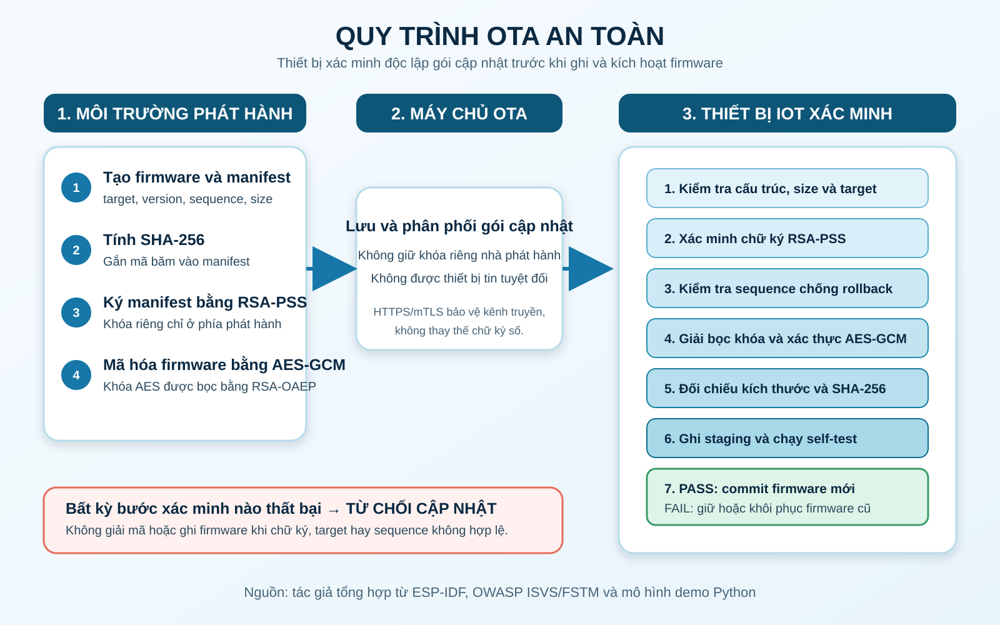

# Đề tài 20 - Cập nhật firmware an toàn cho thiết bị IoT

Repository mô phỏng cục bộ quy trình cập nhật firmware có xác thực nguồn gốc,
kiểm tra toàn vẹn, bảo mật payload, chống rollback và khôi phục khi bản mới
không vượt qua self-test. Đây là lab dùng dữ liệu giả lập; không kết nối hoặc
kiểm thử trên hệ thống thật.

## Thành viên và học phần

- Sinh viên: Trần Thị Hà Vy - MSSV 231A010297
- Lớp học phần: 253INT441001
- Học phần: Bảo mật trong IoT
- Giảng viên hướng dẫn: ThS. Hồ Nhựt Minh
- Repository: <https://github.com/hv6z/n20-secure-firmware-update-iot>

## Cấu trúc repository

```text
configs/                    Chính sách bảo mật của bản demo
data/                       Firmware giả lập v1, v2 và bản lỗi self-test
references/                 Danh mục tài liệu tham khảo và phần đã sử dụng
report/                     Báo cáo tiểu luận Word
results/logs/               Nhật ký chạy thử
results/packages/           Gói cập nhật sinh tự động khi chạy demo
results/device_state/       Trạng thái thiết bị giả lập
slides/                     Slide trình bày
src/                        Mã nguồn demo
update_so_do_hinh_anh/      Sơ đồ và hình minh chứng
```

## Mô hình bảo vệ

1. Máy chủ tạo manifest gồm thiết bị đích, phiên bản, sequence, kích thước và SHA-256.
2. Nhà phát hành ký manifest bằng RSA-PSS/SHA-256.
3. Firmware được mã hóa và xác thực bằng AES-256-GCM; khóa AES dùng một lần được bọc bằng RSA-OAEP/SHA-256.
4. Thiết bị kiểm tra chữ ký, thiết bị đích và sequence trước khi giải mã.
5. Thiết bị xác minh AES-GCM, kích thước và SHA-256, sau đó ghi vào vùng staging.
6. Bản mới chỉ được kích hoạt khi self-test thành công; nếu thất bại, thiết bị giữ/khôi phục bản trước.

Chữ ký số mới là cơ chế xác thực nguồn phát hành. HTTPS/mTLS là lớp bảo vệ kênh
truyền bổ sung, không thay thế kiểm tra chữ ký trên thiết bị.

## Cách chạy demo

Yêu cầu Python 3.11+ và thư viện trong `requirements.txt`.

```powershell
python -m pip install -r requirements.txt
python src/code_demo.py --demo
```

Kết quả mong đợi: 5/5 ca kiểm thử đạt. Ma trận được ghi vào
`results/test_matrix.csv`; log chi tiết nằm tại
`results/logs/secure_update_demo.log`.

## Ca kiểm thử

| Ca kiểm thử | Kỳ vọng | Kiểm soát được xác minh |
|---|---:|---|
| Bản v2 hợp lệ | Chấp nhận | Chữ ký, target, sequence, AES-GCM, SHA-256, self-test |
| Chữ ký manifest bị sửa | Từ chối | Xác thực nguồn phát hành bằng RSA-PSS |
| Payload bị sửa 1 bit | Từ chối | Xác thực AES-GCM |
| Bản v1 có sequence cũ | Từ chối | Chống rollback |
| Bản v3 lỗi self-test | Từ chối | Staging và rollback |

## Minh chứng

### Sơ đồ quy trình OTA an toàn



### Kết quả kiểm thử tái lập

- Ma trận kết quả: [`results/test_matrix.csv`](results/test_matrix.csv)
- Log chạy demo: [`results/logs/secure_update_demo.log`](results/logs/secure_update_demo.log)
- Manifest mẫu: [`results/manifest_v2.json`](results/manifest_v2.json)
- Manifest kèm chữ ký: [`results/signed_manifest_v2.json`](results/signed_manifest_v2.json)
- Slide trình bày hoàn thiện: [`slides/slide_trinh_bay_hoan_thien.pptx`](slides/slide_trinh_bay_hoan_thien.pptx)
- Báo cáo dùng để nộp: [`report/bao_cao_tieu_luan_hoan_thien.docx`](report/bao_cao_tieu_luan_hoan_thien.docx)

## Giới hạn an toàn

- Khóa riêng trong demo được sinh trong bộ nhớ khi chạy; repository không chứa khóa triển khai thật.
- Đây là mô phỏng Python, chưa thay thế bootloader, eFuse, secure element hoặc flash thật.
- Demo chưa triển khai HTTPS/mTLS, quản lý vòng đời khóa, thu hồi khóa, cập nhật vi sai và mất điện giữa quá trình ghi flash.
- Không dùng mã nguồn này để cập nhật thiết bị sản xuất nếu chưa có threat model, kiểm thử độc lập và quy trình quản lý khóa phù hợp.

## Tài liệu tham khảo đã sử dụng

Ngày truy cập các nguồn: **14/07/2026**. Số thứ tự dưới đây thống nhất với ký
hiệu trích dẫn `[1]` đến `[8]` trong báo cáo.

### Nguồn GitHub bắt buộc theo đề bài

1. **Espressif Systems - ESP-IDF Platform Repository**  
   URL: <https://github.com/espressif/esp-idf>  
   Phiên bản tham chiếu: `release-v5.4`; tài liệu API `v5.4.2`.  
   Phần đã sử dụng: HTTPS OTA, phân vùng `otadata`, Secure Boot, app rollback
   và anti-rollback.

2. **OWASP - IoT Security Verification Standard (ISVS)**  
   URL: <https://github.com/OWASP/IoT-Security-Verification-Standard-ISVS>  
   Nhánh tham chiếu: `master`.  
   Phần đã sử dụng: yêu cầu xác minh cơ chế cập nhật phần mềm, tính toàn vẹn,
   xác thực nguồn gốc, bảo vệ khóa và chống rollback.

3. **scriptingxss / OWASP - Firmware Security Testing Methodology (FSTM)**  
   URL: <https://github.com/scriptingxss/owasp-fstm>  
   Nhánh tham chiếu: `master`.  
   Phần đã sử dụng: phương pháp đánh giá firmware gồm chín giai đoạn; tập trung
   vào thu thập thông tin, phân tích firmware, trích xuất và phân tích hệ thống
   tệp. Project chỉ tham khảo phương pháp, không kiểm thử hệ thống thật.

4. **OWASP - IoTGoat: Deliberately Insecure Firmware**  
   URL: <https://github.com/OWASP/IoTGoat>  
   Nhánh tham chiếu: `master`.  
   Phần đã sử dụng: nhận diện các rủi ro thường gặp trong firmware cố ý không
   an toàn và xây dựng tư duy kiểm thử trong lab cục bộ. Project không triển
   khai tấn công IoTGoat hoặc bất kỳ mục tiêu bên ngoài nào.

### Nguồn bổ sung

5. **Espressif Systems - ESP Encrypted Image Abstraction Layer**  
   URL: <https://github.com/espressif/idf-extra-components/tree/master/esp_encrypted_img>  
   Nhánh tham chiếu: `master`.  
   Phần đã sử dụng: tham khảo cấu trúc component xử lý firmware mã hóa và cơ
   chế giải mã dữ liệu theo luồng.

6. **B. Moran, H. Tschofenig, D. Brown và M. Meriac - RFC 9019: A Firmware
   Update Architecture for Internet of Things**, IETF, 2021.  
   URL: <https://www.rfc-editor.org/rfc/rfc9019.html>  
   Phần đã sử dụng: vai trò firmware author, firmware server, firmware
   consumer, manifest, bootloader và chiến lược phục hồi khi cập nhật lỗi.

7. **B. Moran và cộng sự - RFC 9124: A Manifest Information Model for
   Firmware Updates in IoT Devices**, IETF, 2022.  
   URL: <https://www.rfc-editor.org/rfc/rfc9124.html>  
   Phần đã sử dụng: thông tin cần có trong manifest, sequence chống rollback,
   xác thực, bảo vệ khóa ký và điều kiện áp dụng firmware.

8. **Espressif Systems - Over The Air Updates (OTA), ESP-IDF Programming
   Guide v5.4.2**  
   URL: <https://docs.espressif.com/projects/esp-idf/en/v5.4.2/esp32/api-reference/system/ota.html>  
   Phần đã sử dụng: trạng thái image, xác nhận bản cập nhật hoạt động, app
   rollback và anti-rollback dựa trên security version/eFuse.

Danh mục trên cũng được lưu tại `references/link_nguon.md`. Mọi nội dung kỹ
thuật lấy từ các nguồn đều được diễn giải lại và gắn số trích dẫn tương ứng
trong `report/bao_cao_tieu_luan.docx`.
